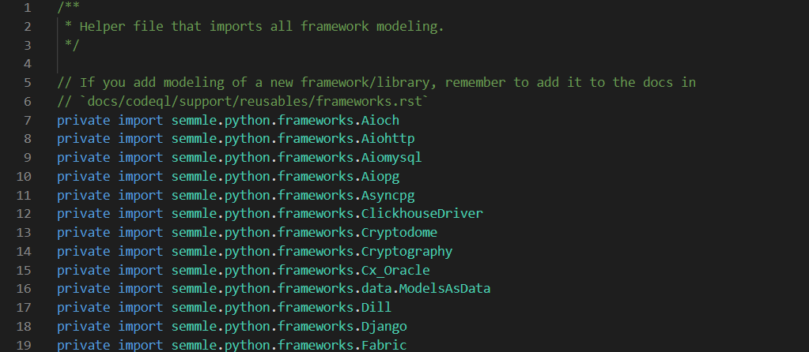
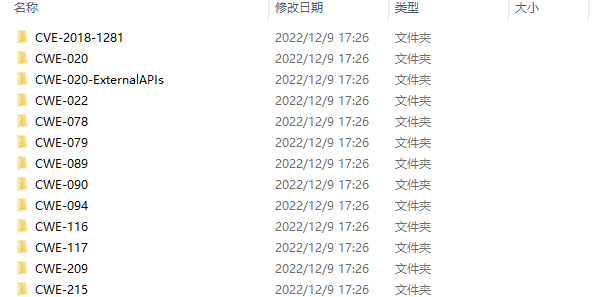

## CodeQL概览

[TOC]

### 一、前世今生

1、Semmle公司最早起源于牛津大学的CodeQuest系统，从学术到工业落地后，逐渐开始深入代码安全性分析

2、Semmle公司的lgtm平台长期监控GitHub开源项目（比如微软、NASA、Google），发现并上报了诸多中间件安全与框架安全漏洞，逐渐在安全圈打出了知名度

3、19年微软GitHub收购Semmle，同年开源了CodeQL 引擎

4、22年底关闭了LGTM.com平台

### 二、CodeQL标准库

开源部分为QL语言查询库，主要用来进行编写、扩展QL规则，进行漏洞查找

github源码地址：https://github.com/github/codeql

官方使用教程：https://codeql.github.com/docs/

相关目录结构：

- 根目录：

  - 配置目录

  - 文档

  - 各种语言的查询库：进入特定语言的目录查看，例如Python目录

    - 文档目录

    - 配置目录

    - tools：部分语言存在，辅助工具等

    - ql库目录：每种语言的主要查询库，集成大量内置规则

      - lib库：标准查询库，提供了编写ql语言的大量库，比如数据流、source点、sink点、API图等

        例如内置的Source和sink：

        

      - src：内置ql规则库，包含有限的安全类和非安全类规则

        例如CWE关联规则(ql/src/Security)：

        

        

    - tools：一些辅助工具

    - 其他目录：略

### 三、CodeQL解释执行引擎

未开源

codeql-cli-binaries：命令行执行工具，数据库创建、数据库查询等

github下载地址：https://github.com/github/codeql-cli-binaries

官方使用教程：https://codeql.github.com/docs/

相关目录结构：

-  执行入口：codeql（Linux/Mac）/codeql.exe（Windows)
  - 详细执行流程分析参考：https://paper.seebug.org/1921/
  - codeql整个调度流程是JAVA语言编写
- 具体语言目录：以Python举例
  - tools：提取器
    - 自动构建脚本
    - xxx.zip：提取器工具
  - 其他配置：略