## 数据库构建原理

[TOC]

文档以Python举例，其他语言的思路应该是一致的，可能方法上略有不同：

主要流程大概是：数据库初始化 --> 提取器执行（通过AST生成trap文件） -- trap文件导入原始数据集 -- 生成最终database数据库

### 一、创建数据库

创建命令：

```
codeql database create codeql_security_test2 --language=python --source-root=D:/qy/codeql/codeql_learn
```

### 二、数据库目录结构

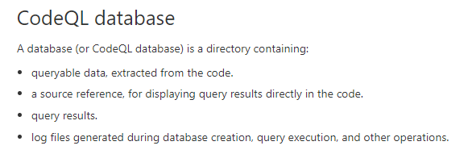

- db-python：可查询数据集
- log：创建和查询日志
- results：查询结果的bqrs文件，用来转换为其他结果格式
- src.zip：源代码

### 三、数据库生成原理


#### 1、分析数据库构建日志

实际创建一个数据库，查看日志，大致分为一下三个阶段：

- 数据库初始化：

  创建空的codeql数据库

  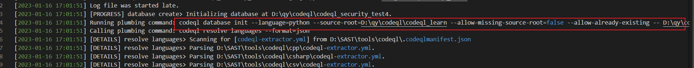

- 提取器执行：

  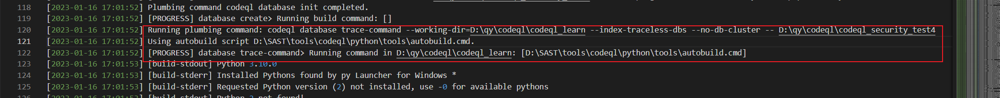

  从上图可以看到提取器执行trace-command命令，以及自动构建脚本autobuild.cmd，主要为提取源码，基于AST生成trap文件，下面几小节分析。

- 数据集导入：

  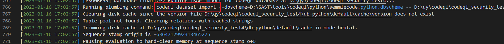

  将tarp文件导入最终数据集，也就是 db-python 目录

#### 2、自动构建脚本

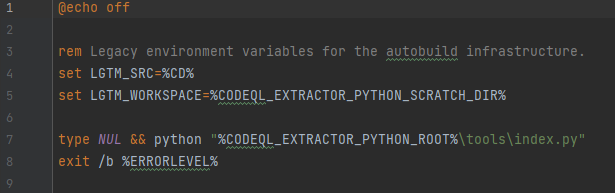

- 执行当前目录的index脚本

- index脚本调用 

  ```
  import buildtools.index
  buildtools.index.main()
  ```

- 解压python3src.zip 得到包：buildtools

- 接下来可自行构建相关Pycharm调试环境，这一步不赘述

- 有一些环境变量需自行添加

- 进行调试会发现主要入口调用：`python_tracer.py`，相关参数自行调试获取

- 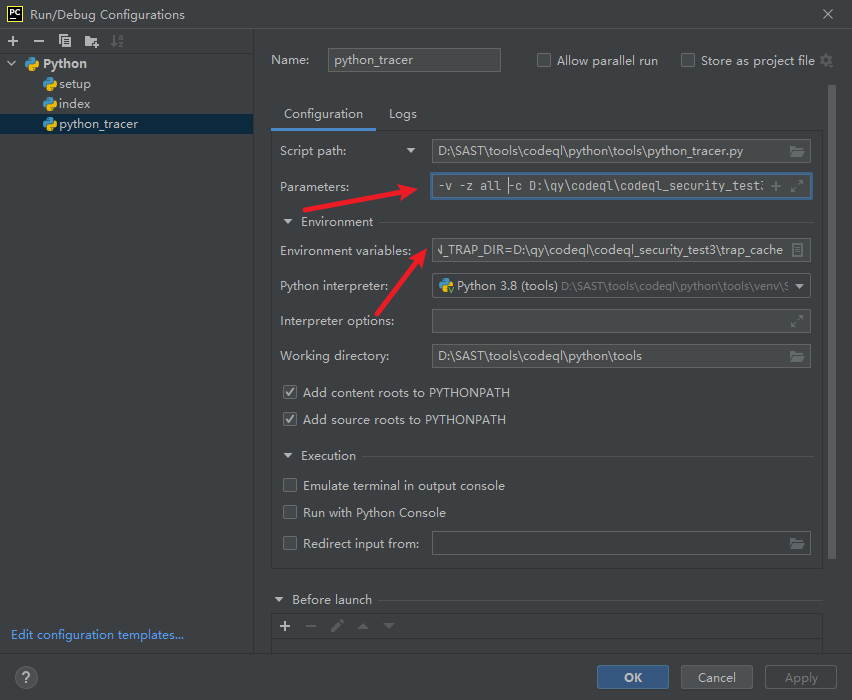

#### 3、Python tracer

- 主要流程是：创建进程池+任务队列

  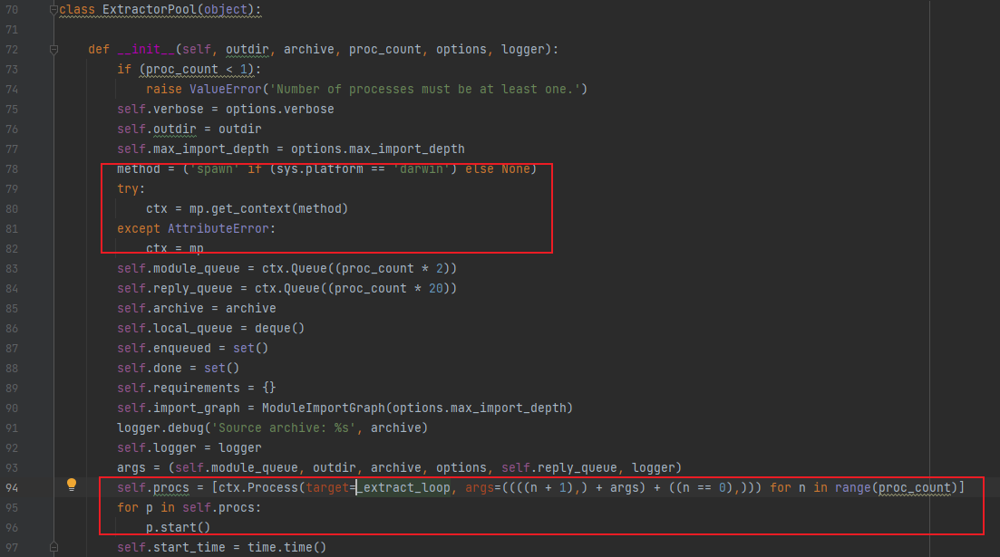

- 进程池调用提取器函数处理文件

- 遍历所有文件，逐个文件发给上述队列处理

#### 4、提取器

做扫描引擎开发的可能感兴趣这一块

- 分为内建提取器、第三方包提取器、代码提取器、包提取器、文件提取器

  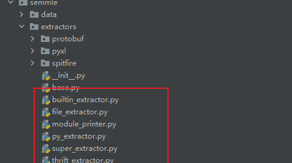

- 遍历、递归处理每一个文件，以及文件import 的包，递归将每一个包以及依赖的系统包和第三方包全部处理，都会从系统安全的Python环境里查找

  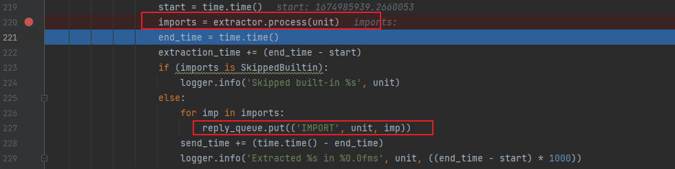

- 源码处理模块：主要处理入口`process_source_module`

  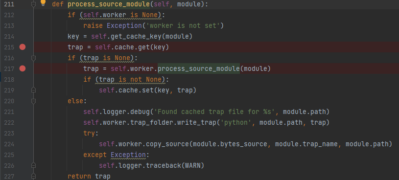

- 三阶段pass处理AST，有点类似于LLVM pass阶段了

  - 处理AST的基本结构
  - 处理导出表
  - 处理函数调用，生成调用图

  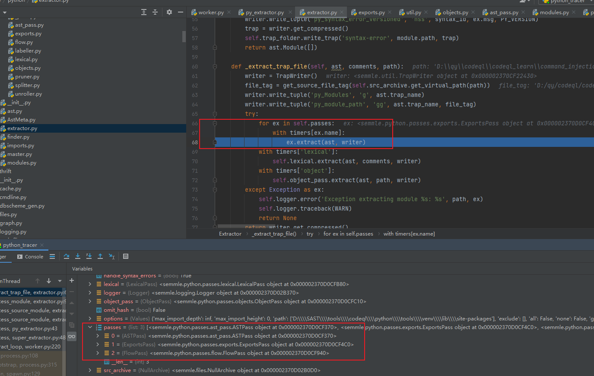

- 处理完成写入trap文件：压缩包

  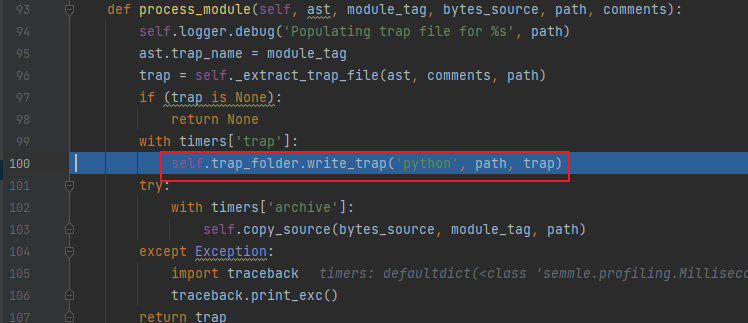

#### 5、trap文件

- 解压trap文件查看

  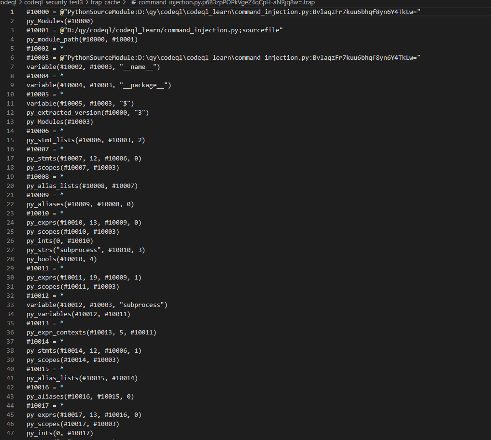

- tarp文件格式：datalog数据查询语言

  ```
  Datalog是一种数据查询语言，专门设计与大型关系数据库交互[1]，语法与Prolog相似。正如SQL只是一个规范，Transact-SQL、PL-SQL是其具体实现一样；Datalog也是一个规范，bddbddb[2]、 DES[3]、OverLog[4]、Deals[5]等都按照Datalog的语法实现了自己的语言，所以Datalog没有特定的执行环境（如Java之于Java虚拟机，Prolog之于SWI-Prolog）。
  ```

  

  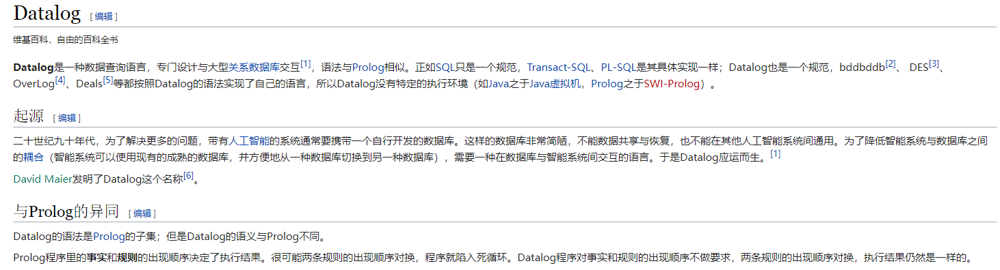

#### 6、rel文件

- 上述trap文件生成后，codeql命令行执行 数据集导入，生成最终rel二进制文件，用来最终进行查询
- rel文件是自动生成，可以不用关注
- 生成rel文件后，数据库最终生成
